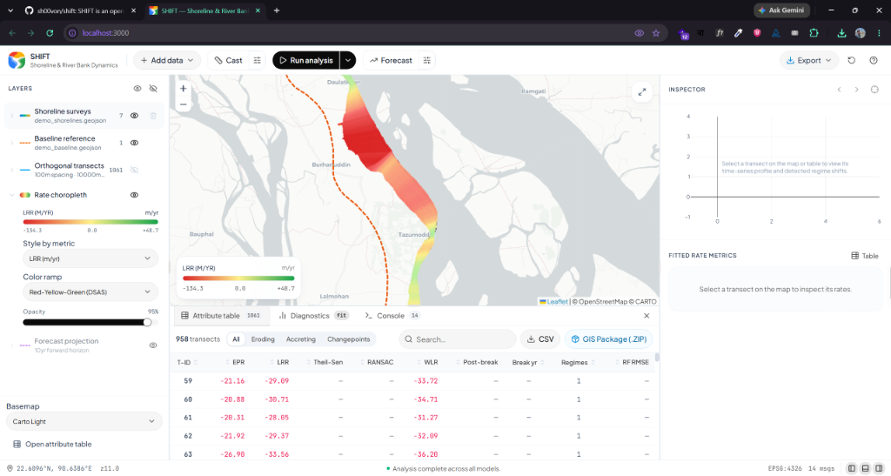
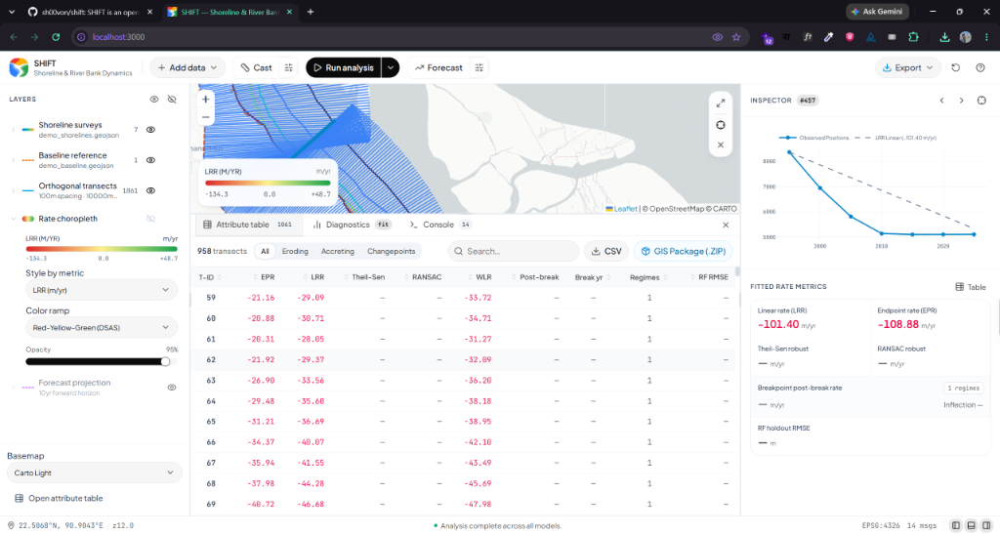
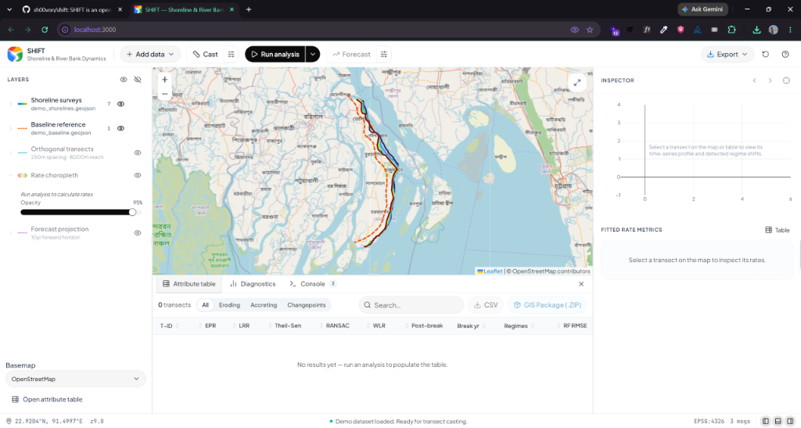
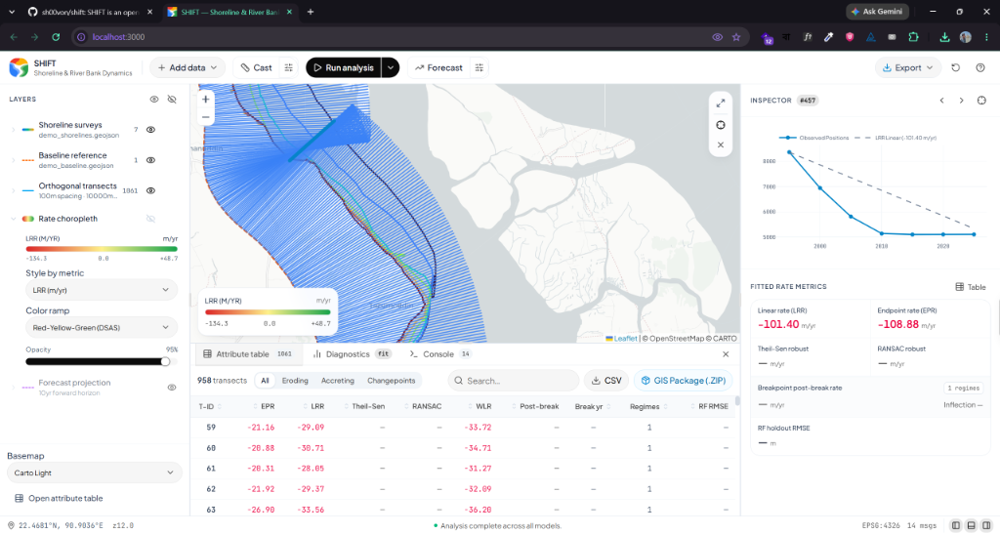

<p align="center">
  
</p>

# SHIFT: Shoreline Intelligence, Forecasting & Trends - An Open-Source System for Shoreline and River Bank Dynamics

<p align="center">
  <a href="https://www.python.org/"></a>
  <a href="LICENSE"></a>
  <a href="https://nextjs.org/"></a>
  <a href="https://react.dev/"></a>
  <a href="https://fastapi.tiangolo.com/"></a>
  <a href="https://doi.org/10.5281/zenodo.22046678"></a>
</p>

**SHIFT** is a modern geospatial changepoint framework and interactive analysis workbench for coastal shoreline and river bank time-series. It is built as a web-native, open-source alternative to legacy GIS tools (like USGS DSAS), pairing classic shoreline/river bank change metrics with structural changepoint detection (regime shifts) and robust outlier-resistant regressions.

### 📸 Screenshots Gallery
<div align="center">
  
  
  <br>
  
  
</div>

---

## 🌟 Key Features

* **Automated Transect Caster**: Cast shore-perpendicular orthogonal transects along baseline curves with custom spacing, smoothing windows, and reach lengths.
* **Unified Statistics Suite**:
  * **USGS DSAS Rates**: End Point Rate (EPR), Linear Regression Rate (LRR), Weighted Linear Regression (WLR), Net Shoreline Movement (NSM), Shoreline Change Envelope (SCE).
  * **Robust Regression**: Outlier-resistant rate estimation using Theil-Sen estimators and RANSAC.
  * **Regime Changepoint Detection**: Automated changepoint analysis (Pelt) detecting structural shifts in coastal trends (erosion-to-accretion transitions).
  * **Machine Learning Benchmark**: Non-linear shoreline change rates using Random Forest regressions.
* **Spacious GIS Workbench UI**: 
  * Responsive Leaflet map with satellite/topographic basemaps.
  * Full-screen interactive Field Mapping Modal with custom date format parsers and on-the-fly uncertainty column creation.
  * Interactive Transect Inspector showing fit lines, changepoint indicators, and raw timeline charts.
  * Attribute Table dock with instant sorting, filters (Eroding, Accreting, Changepoint transects), and statistics.
* **Comprehensive GIS Package Export**: 1-click download of a compiled `.ZIP` containing formatted CSV rate metrics, raw intersections, full and envelope-clipped rate transects (GeoJSON), forecast shapes, and runtime configs.

---

## 🏗️ System Architecture

SHIFT is designed with a detached client-server model:
* **Backend Engine (`shift/` + `api/`)**: Built in Python with **GeoPandas**, **Shapely**, **PyProj**, **Ruptures** (for Peltier changepoints), and **Scikit-Learn**. Exposed as a REST + WebSocket API via **FastAPI**.
* **Frontend Interface (`frontend/`)**: Built using **Next.js (App Router)**, **React 19**, **TypeScript**, **Zustand** state store, and **Tailwind CSS**. Map rendering is handled natively through **Leaflet**.

---

## 🚀 Getting Started

### Prerequisites
* Python 3.11+
* Node.js 18+ and `npm`

### 1. Run the Python Backend
```bash
# Clone the repository
git clone https://github.com/sh00von/shift.git
cd shift

# Create a virtual environment
python -m venv venv
source venv/bin/activate  # Windows: venv\Scripts\activate

# Install the package in editable mode with all dependencies
pip install -e ".[dev,app]"

# Launch the FastAPI server
uvicorn api.main:app --port 8000 --reload
```

### 2. Run the Next.js Frontend
```bash
cd frontend

# Install Node modules
npm install

# Run the Next.js dev server
npm run dev
```
Open [http://localhost:3000](http://localhost:3000) in your browser to access the SHIFT Workbench.

---

## 📈 Usage Workflow

1. **Load Data**: Open the top menu and load the embedded **Bhola Island Demo Dataset** or upload your shoreline survey GeoJSON and offshore/onshore baseline.
2. **Configure Fields**: Map the survey Date column, set the date format, and map/create the Uncertainty attribute.
3. **Generate Transects**: Set spacing, reach, and cast direction, then preview/cast the orthogonal transects.
4. **Run Analysis**: Choose which models to fit (DSAS, Robust, Pelt, Random Forest) and compute rate metrics.
5. **Inspect & Forecast**: Click any transect to see the fitted model chart. Adjust the forecasting horizon to visualize future shoreline uncertainty envelopes.
6. **Export**: Export the tabular CSV or download the complete **GIS Bundle (.ZIP)** for analysis in QGIS / ArcGIS Pro.

---

## 🧪 Running Tests

Validate the statistical engine and geometry caster using `pytest`:
```bash
python -m pytest
```

---

## 📄 License

This project is licensed under the MIT License - see the [LICENSE](LICENSE) file for details.

## 🎓 Citation

If you use SHIFT in your academic research or thesis, please cite it using:
```bibtex
@software{Shovon_SHIFT_2026,
  author  = {Md. Minaruzzaman Shovon},
  title   = {SHIFT: Shoreline Intelligence, Forecasting & Trends - An Open-Source System for Shoreline and River Bank Dynamics},
  version = {0.2.0},
  year    = {2026},
  doi     = {10.5281/zenodo.22046678},
  url     = {https://doi.org/10.5281/zenodo.22046678}
}
```
Alternatively, see the [CITATION.cff](CITATION.cff) file for full metadata details.
